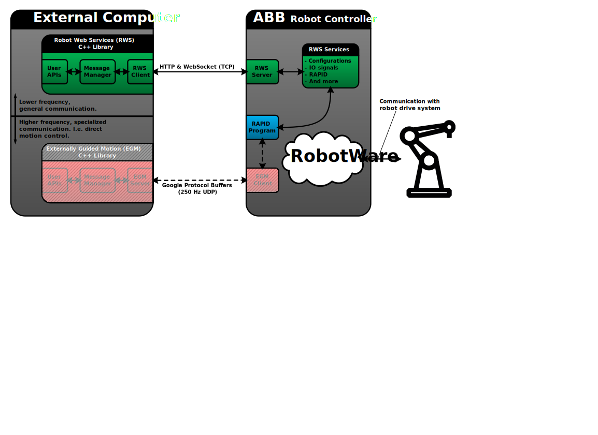

# abb_librws

## Overview

A C++ library for interfacing with ABB robot controllers supporting *Robot Web Services* (RWS). See the online [documentation](http://developercenter.robotstudio.com/webservice/api_reference) for a detailed description of what RWS is and how to use it.

See [abb_libegm](https://github.com/ros-industrial/abb_libegm) for a companion library that interfaces with *Externally Guided Motion* (EGM).

### Sketch

The following is a conceptual sketch of how this RWS library can be viewed, in relation to an ABB robot controller as well as the EGM companion library mentioned above.

### Requirements

* RobotWare version `6.0` or higher.

### Dependencies

* [POCO C++ Libraries](https://pocoproject.org) (`>= 1.4.3` due to WebSocket support)

### Limitations

RWS provides access to several services and resources in the robot controller, and this library currently support the following:

* Reading/writing of IO-signals.
* Reading/writing of RAPID data.
* Reading of RAPID data properties.
* Starting/stopping/resetting the RAPID program.
* Subscriptions (i.e. receiving notifications when resources are updated).
* Uploading/downloading/removing files.
* Checking controller state (e.g. motors on/off, auto/manual mode and RAPID execution running/stopped).
* Reading the joint/Cartesian values of a mechanical unit.
* Register as a local/remote user (e.g. for interaction during manual mode).
* Turning the motors on/off.
* Reading of current RobotWare version and available tasks in the robot system.

### Recommendations

* This library has been verified to work with RobotWare `6.06.01`. Other version are expected to work, but this cannot be guaranteed at the moment.
* It is a good idea to perform RobotStudio simulations before working with a real robot.
* It is prudent to familiarize oneself with general safety regulations (e.g. described in ABB manuals).
* Consider cyber security aspects, before connecting robot controllers to networks.

## Acknowledgements

The **core development** has been supported by the European Union's Horizon 2020 project [SYMBIO-TIC](http://www.symbio-tic.eu/).
The SYMBIO-TIC project has received funding from the European Union's Horizon 2020 research and innovation programme under grant agreement no. 637107.

The **open-source process** has been supported by the European Union's Horizon 2020 project [ROSIN](http://rosin-project.eu/).
The ROSIN project has received funding from the European Union's Horizon 2020 research and innovation programme under grant agreement no. 732287.

The opinions expressed reflects only the author's view and reflects in no way the European Commission's opinions.
The European Commission is not responsible for any use that may be made of the contained information.

### Special Thanks

Special thanks to [gavanderhoorn](https://github.com/gavanderhoorn) for guidance with open-source practices and ROS-Industrial conventions.
