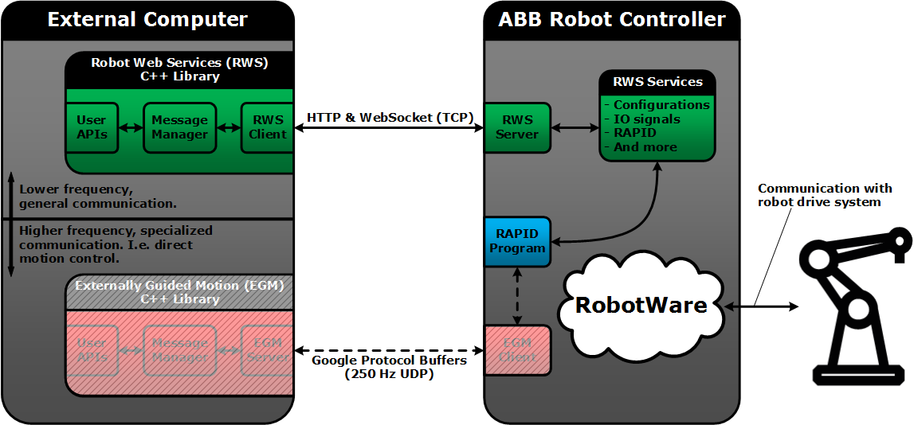

# abb_librws

## Overview

A C++ library for interfacing with ABB robot controllers supporting Robot Web Services (RWS).

See [abb_libegm](https://github.com/ros-industrial/abb_libegm) for a companion library that interfaces with EGM.

### Sketch

The following is a conceptual sketch of how this RWS library can be viewed, in relation to an ABB robot controller as well as the EGM companion library mentioned above. 

### Requirements

* RobotWare 6.0 or higher.

### Limitations

This library supports several of the RWS services, but not all of them. Some of the supported features are:
* Reading/writing of IO-signals.
* Reading/writing of RAPID data.
* Starting/stopping/resetting the RAPID program.
* Subscriptions (i.e. receiving notifications when resources are updated).
* Uploading/downloading/removing files.
* Checking controller state (e.g. motors on/off, auto/manual mode and RAPID execution running/stopped).
* And more.

### Recommendations

* The current version of this library is recommended to be used with **RobotWare 6.06.01**.
* It is recommended to perform RobotStudio simulations before working with a real robot.
* It is also recommended to familiarize oneself with general safety regulations (e.g. described in ABB manuals).